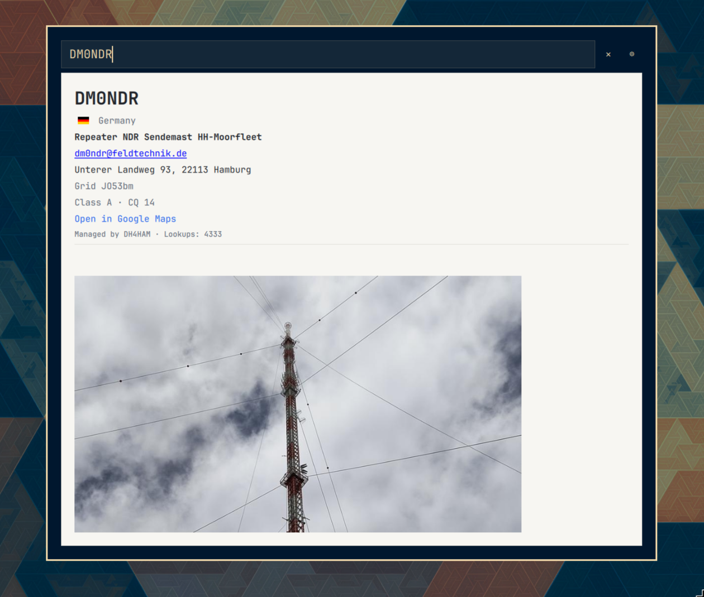

# QRZ

Look up amateur radio callsigns on QRZ.com from the Omarchy bar or a keyboard shortcut.

> Omarchy 4/Quattro shell plugin. Plugin ID: `do1mj.qrz`.



## Features

- Bar widget that opens a focused callsign search overlay
- Keyboard shortcut activation (`SUPER + CTRL + SHIFT + Q` by default)
- Input field receives focus immediately so typing can start at once
- Looks up `https://www.qrz.com/db/CALLSIGN`
- Shows a spinner while a lookup is in progress
- Displays QRZ `table#jq` data and biography (`#biodata`) below the input field
- Optional QRZ.com XML login (gear icon) for name, email, address, grid, and QSL prefs
- Hides the result as soon as the callsign is cleared or changed, then searches again
- Only auto-searches once 5+ characters are typed; Enter searches immediately regardless of length
- Renders a formatted “no results” page when QRZ reports no match

## Compatibility

- Omarchy: 4/Quattro (`4.0.0.alpha` and compatible)
- Manifest schema: `1`
- Plugin kinds: `overlay`, `bar-widget`

## Requirements

- Omarchy 4 / `omarchy-shell`
- `python3` (used to fetch and extract the QRZ page)

## Installation

From Git once published:

```bash
omarchy plugin add https://github.com/hirschnase/omarchy-do1mj.qrz.git
omarchy plugin enable do1mj.qrz --section right
```

Review the plugin source before enabling it. Omarchy plugins execute unsandboxed inside the long-running shell process.

From this source tree:

```bash
make install
```

`make install` copies the plugin into `~/.config/omarchy/plugins/do1mj.qrz/`, enables the bar widget, and adds the Hyprland shortcut.

## Configuration

Optional QRZ XML login is stored at `~/.config/do1mj.qrz/settings.json` (file mode `600`):

```json
{
  "username": "CALLSIGN",
  "password": "secret",
  "sessionKey": "…",
  "authError": ""
}
```

Open the overlay and click the gear icon to enter credentials, save them, or check the login. A valid session key is reused on later lookups and renewed automatically from the stored username/password when it expires. If that automatic renewal fails, the failure is recorded in `authError` and shown in the settings page instead of being retried on every subsequent lookup; renewal only resumes once you save or successfully check new credentials.

The widget is placed in the bar `right` section by default.

Optional Hyprland shortcut (also written by `make install`):

```lua
o.bind("SUPER + CTRL + SHIFT + Q", "QRZ callsign lookup", "omarchy-shell shell toggle do1mj.qrz '{}'")
```

Override the key while installing:

```bash
make install BIND_KEY='SUPER + ALT + Q'
```

## Usage

- Click the QRZ bar icon, or press the shortcut
- Type a callsign; the overlay focuses the field on open
- Search runs on Enter or after a short pause when the callsign looks valid
- Changing or clearing the field hides the current page immediately
- Click the gear icon to save QRZ.com credentials and test the XML login
- Escape closes settings first, then clears the field, then dismisses the overlay

### IPC

```bash
omarchy-shell shell toggle do1mj.qrz '{}'
omarchy-shell shell summon do1mj.qrz '{"callsign":"W1AW"}'
```

## Makefile

| Target | Action |
| --- | --- |
| `make` / `make validate` | Validate the plugin manifest and files |
| `make build` / `make compile` | Validate only; there is no compile step |
| `make install` | Install, enable, and bind the shortcut |
| `make run` | Install and toggle the overlay |
| `make uninstall` / `make delete` | Disable, unbind, and remove the installed copy |

## Security and privacy

- Launches `python3 scripts/qrz-lookup.py <CALLSIGN>` and `python3 scripts/qrz-xml.py <load|save|check>` with structured arguments (no shell interpolation)
- Contacts `https://www.qrz.com/db/<CALLSIGN>` and `https://xmldata.qrz.com/xml/current/`
- May load QRZ CDN/static images (photo, flag, biography)
- Stores QRZ username, password, and session key in `~/.config/do1mj.qrz/settings.json` with mode `600`
- Does not log passwords or callsigns
- `make install` writes a marked block to `~/.config/hypr/bindings.lua`
- No privileged actions

## Development

```bash
make validate
omarchy plugin validate .
omarchy-shell shell rescanPlugins
```

Saving files under `~/.config/omarchy/plugins/` reloads plugin code automatically.

## Troubleshooting

### Plugin is not discovered

- Confirm `manifest.json` is at the repository root
- Run `omarchy plugin validate .`
- Confirm the plugin ID is `do1mj.qrz` and is not in the reserved `omarchy.*` namespace
- Confirm the repository contains no symlinks

### Overlay does not open from the shortcut

- Confirm the plugin is enabled: `omarchy plugin list`
- Confirm `~/.config/hypr/bindings.lua` contains the `do1mj.qrz` bind block
- Run `hyprctl reload` and try `omarchy-shell shell toggle do1mj.qrz '{}'`

### Result view is empty or unstyled

- Confirm network access to `qrz.com`
- Some QRZ fields require a QRZ login and will not appear on the public page

## License

MIT. See [LICENSE](LICENSE).
